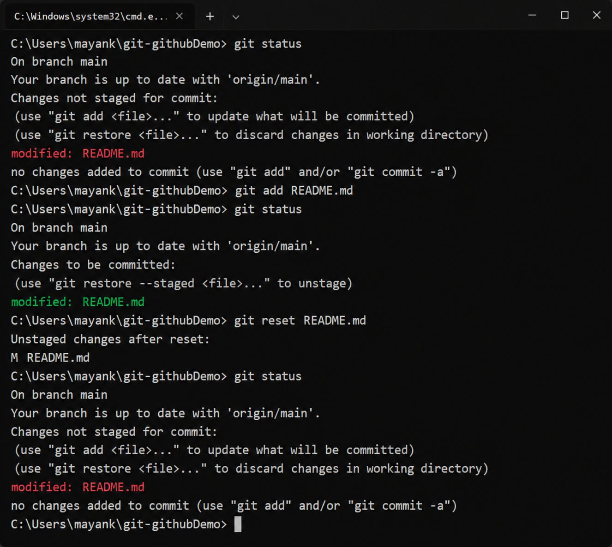

# Session 5 — Git & GitHub

## Overview

This session focused on Git operations related to staging, resetting, committing,
branching, and selectively applying commits.

The practical work documented in this session covers:

1. `git reset README.md`
2. `git commit -a -m`
3. Git cherry-pick

---

## 1. Git Reset

### Objective

To understand how `git reset README.md` affects a file that has already been staged.

### Commands Tested

First, the `README.md` file was modified and checked using:

```bash
git status
```

The file appeared under:

```text
Changes not staged for commit:
    modified: README.md
```

The file was then staged:

```bash
git add README.md
```

After running `git status`, it appeared under:

```text
Changes to be committed:
    modified: README.md
```

The reset command was then tested:

```bash
git reset README.md
```

Finally, `git status` was run again.

### Result

After running:

```bash
git reset README.md
```

the file moved from:

```text
Changes to be committed
```

back to:

```text
Changes not staged for commit
```

The changes inside `README.md` were **not deleted**.

### In Simple Terms

```text
Modified File
     │
     ▼
  git add
     │
     ▼
   Staged
     │
     ▼
git reset README.md
     │
     ▼
  Unstaged
```

Therefore:

> **`git reset README.md` removes the file from the staging area but keeps the changes in the working directory.**

### Practical Evidence

The complete terminal output from this test is shown below.

**Figure 1 — Git Reset Test**



---

## 2. `git commit -a -m`

### Objective

To understand the difference between the regular `git commit -m` command and
`git commit -a -m`.

### Regular `git commit -m`

The normal workflow requires changes to be staged before committing:

```bash
git add README.md
git commit -m "Update README"
```

`git commit -m` commits the changes that have already been added to the
staging area.

### `git commit -a -m`

The `-a` option automatically stages **modified and deleted files that are
already tracked by Git** and then commits them.

Example:

```bash
git commit -a -m "Update README"
```

This can be useful when working with files that Git is already tracking.

### Important Difference

| `git commit -m` | `git commit -a -m` |
|---|---|
| Commits staged changes | Automatically stages modified/deleted tracked files |
| Requires `git add` first for unstaged modifications | Can skip `git add` for tracked modifications |
| Does not automatically include untracked files | Does not include untracked files |
| Gives explicit control over what is staged | Convenient for quick commits of tracked files |

### Important Note

The `-a` option **does not add new untracked files**.

For example, if `newfile.txt` has never been tracked:

```bash
git commit -a -m "Add new file"
```

will not include it.

It must first be added:

```bash
git add newfile.txt
```

---

## 3. Git Cherry-Pick

### Objective

To understand how a specific commit from another branch can be applied to
the current branch without merging the entire branch.

### Basic Workflow

A typical cherry-pick workflow is:

```text
main
 │
 ├── Commit A
 ├── Commit B
 └── Commit C
        │
        └── create new branch
              │
              ├── Commit D
              ├── Commit E
              └── Commit F
```

A specific commit can then be selected and applied to `main`:

```bash
git cherry-pick <commit-hash>
```

The result is conceptually:

```text
main
 │
 ├── Commit A
 ├── Commit B
 ├── Commit C
 └── Commit D'
```

where `Commit D'` contains the changes introduced by the selected commit.

### Useful Commands

View the commit history:

```bash
git log --oneline
```

Create a new branch:

```bash
git checkout -b feature
```

After making commits on the branch, return to `main`:

```bash
git checkout main
```

Apply a specific commit:

```bash
git cherry-pick <commit-hash>
```

Verify the history:

```bash
git log --oneline --graph --all
```

### Why Cherry-Pick Is Useful

Cherry-picking is useful when only a particular commit from another branch
is required, instead of merging all the changes from that branch.

For example, if a branch contains:

```text
Commit D
Commit E
Commit F
```

but only the changes from `Commit E` are required, that individual commit can
be cherry-picked into `main`.

---

## Key Takeaways

- `git reset README.md` can unstage a file without deleting its changes.
- `git commit -m` commits changes that have already been staged.
- `git commit -a -m` automatically stages modifications and deletions to
  already-tracked files before committing.
- `git commit -a -m` does not include new untracked files.
- `git cherry-pick` allows a specific commit to be applied to another branch.
- `git log --oneline --graph --all` is useful for understanding branch and
  commit history.

---

## Conclusion

This session covered practical Git operations that are useful when managing
changes across branches and controlling what gets included in commits.

Understanding staging, resetting, committing, branching, and cherry-picking
provides a stronger foundation for working with Git in collaborative
development environments.

---

## Author

**Mayank Raj**  
**Roll No.: 24BCS10351**
