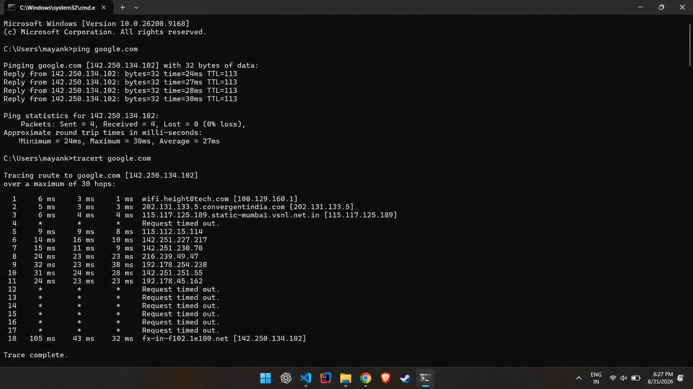
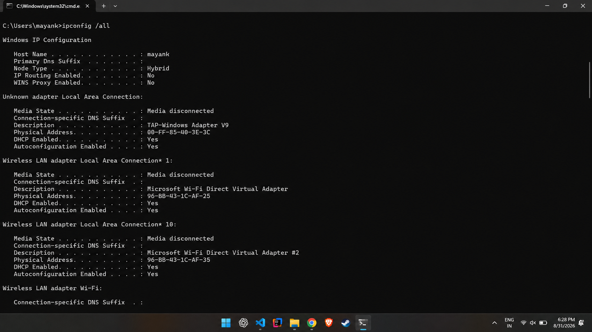
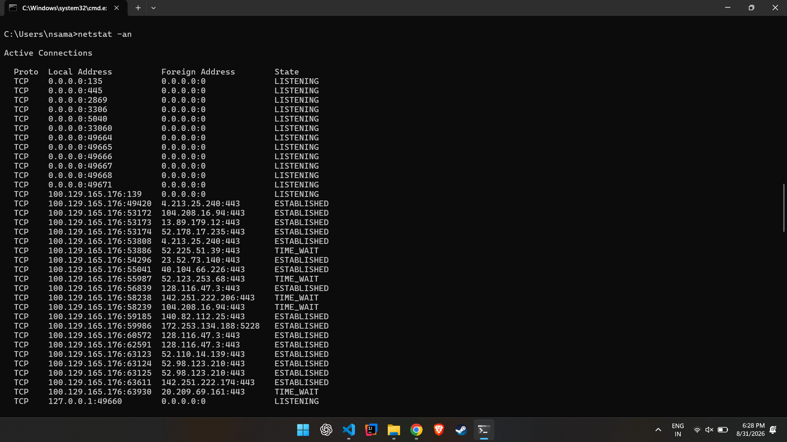
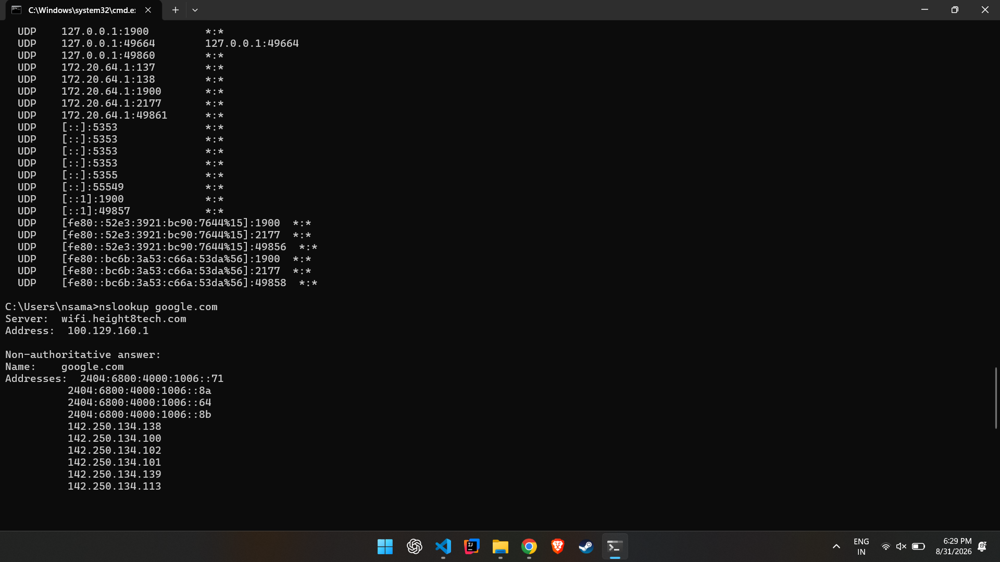

# Commands Output – Session 4 Networking

## My Ping Output

```
Pinging google.com [142.250.134.102] with 32 bytes of data:
Reply from 142.250.134.102: bytes=32 time=24ms TTL=113
Reply from 142.250.134.102: bytes=32 time=27ms TTL=113
Reply from 142.250.134.102: bytes=32 time=28ms TTL=113
Reply from 142.250.134.102: bytes=32 time=30ms TTL=113

Ping statistics for 142.250.134.102:
    Packets: Sent = 4, Received = 4, Lost = 0 (0% loss),
Approximate round trip times in milli-seconds:
    Minimum = 24ms, Maximum = 30ms, Average = 27ms
```

---

## My Tracert Output

```
Tracing route to google.com [142.250.134.102]
over a maximum of 30 hops:

  1     6 ms     3 ms     1 ms  wifi.height8tech.com [100.129.160.1]
  2     5 ms     3 ms     3 ms  202.131.133.5.convergentindia.com [202.131.133.5]
  3     6 ms     4 ms     4 ms  115.117.125.189.static-mumbai.vsnl.net.in [115.117.125.189]
  4     *        *        *     Request timed out.
  5     9 ms     9 ms     8 ms  115.112.15.114
  6    14 ms    16 ms    10 ms  142.251.227.217
  7    15 ms    11 ms     9 ms  142.251.230.70
  8    24 ms    23 ms    23 ms  216.239.49.47
  9    32 ms    23 ms    38 ms  192.178.254.238
 10    31 ms    24 ms    28 ms  142.251.251.55
 11    24 ms    23 ms    23 ms  192.178.45.162
 12     *        *        *     Request timed out.
 13     *        *        *     Request timed out.
 14     *        *        *     Request timed out.
 15     *        *        *     Request timed out.
 16     *        *        *     Request timed out.
 17     *        *        *     Request timed out.
 18   105 ms    43 ms    32 ms  fx-in-f102.1e100.net [142.250.134.102]

Trace complete.
```


---

## My Checksum (CertUtil) Output

```
C:\Users\nsama\testfile.txt:
9f86d081884c7d659a2feaa0c55ad015a3bf4f1b2b0b822cd15d6c15b0f00a08

CertUtil: -hashfile command completed successfully.
```

---

## My IPConfig Output

```
Windows IP Configuration

   Host Name . . . . . . . . . . . . : mayank
   Primary Dns Suffix  . . . . . . . :
   Node Type . . . . . . . . . . . . : Hybrid
   IP Routing Enabled. . . . . . . . : No
   WINS Proxy Enabled. . . . . . . . : No

Unknown adapter Local Area Connection:

   Media State . . . . . . . . . . . : Media disconnected
   Connection-specific DNS Suffix  . :
   Description . . . . . . . . . . . : TAP-Windows Adapter V9
   Physical Address. . . . . . . . . : 00-FF-85-40-3E-3C
   DHCP Enabled. . . . . . . . . . . : Yes
   Autoconfiguration Enabled . . . . : Yes

Wireless LAN adapter Local Area Connection* 1:

   Media State . . . . . . . . . . . : Media disconnected
   Connection-specific DNS Suffix  . :
   Description . . . . . . . . . . . : Microsoft Wi-Fi Direct Virtual Adapter
   Physical Address. . . . . . . . . : 96-BB-43-1C-AF-25
   DHCP Enabled. . . . . . . . . . . : Yes
   Autoconfiguration Enabled . . . . : Yes

Wireless LAN adapter Local Area Connection* 10:

   Media State . . . . . . . . . . . : Media disconnected
   Connection-specific DNS Suffix  . :
   Description . . . . . . . . . . . : Microsoft Wi-Fi Direct Virtual Adapter #2
   Physical Address. . . . . . . . . : 96-BB-43-1C-AF-35
   DHCP Enabled. . . . . . . . . . . : Yes
   Autoconfiguration Enabled . . . . : Yes

Wireless LAN adapter Wi-Fi:

   Connection-specific DNS Suffix  . :
   Description . . . . . . . . . . . : MediaTek MT7921 Wi-Fi 6 802.11ax PCIe Adapter
   Physical Address. . . . . . . . . : 94-BB-43-1C-AF-25
   DHCP Enabled. . . . . . . . . . . : Yes
   Autoconfiguration Enabled . . . . : Yes
   Link-local IPv6 Address . . . . . : fe80::52e3:3921:bc90:7644%15(Preferred)
   IPv4 Address. . . . . . . . . . . : 100.129.165.176(Preferred)
   Subnet Mask . . . . . . . . . . . : 255.255.240.0
   Lease Obtained. . . . . . . . . . : Monday, August 31, 2026 2:06:24 PM
   Lease Expires . . . . . . . . . . : Tuesday, September 1, 2026 5:59:49 PM
   Default Gateway . . . . . . . . . : 100.129.160.1
   DHCP Server . . . . . . . . . . . : 100.129.160.1
   DHCPv6 IAID . . . . . . . . . . . : 143964995
   DHCPv6 Client DUID. . . . . . . . : 00-01-00-01-2F-7A-50-6A-28-C5-C8-39-85-5F
   DNS Servers . . . . . . . . . . . : 100.129.160.1
                                       8.8.8.8
   NetBIOS over Tcpip. . . . . . . . : Enabled

Ethernet adapter Ethernet:

   Media State . . . . . . . . . . . : Media disconnected
   Connection-specific DNS Suffix  . :
   Description . . . . . . . . . . . : Realtek Gaming GbE Family Controller
   Physical Address. . . . . . . . . : 28-C5-C8-39-85-5F
   DHCP Enabled. . . . . . . . . . . : Yes
   Autoconfiguration Enabled . . . . : Yes

Ethernet adapter vEthernet (WSL (Hyper-V firewall)):

   Connection-specific DNS Suffix  . :
   Description . . . . . . . . . . . : Hyper-V Virtual Ethernet Adapter
   Physical Address. . . . . . . . . : 00-15-5D-CC-BE-12
   DHCP Enabled. . . . . . . . . . . : No
   Autoconfiguration Enabled . . . . : Yes
   Link-local IPv6 Address . . . . . : fe80::bc6b:3a53:c66a:53da%56(Preferred)
   IPv4 Address. . . . . . . . . . . : 172.20.64.1(Preferred)
   Subnet Mask . . . . . . . . . . . : 255.255.240.0
   Default Gateway . . . . . . . . . :
   DHCPv6 IAID . . . . . . . . . . . : 939529565
   DHCPv6 Client DUID. . . . . . . . : 00-01-00-01-2F-7A-50-6A-28-C5-C8-39-85-5F
   NetBIOS over Tcpip. . . . . . . . : Enabled
```



---

## My Netstat Output

```

Active Connections

  Proto  Local Address          Foreign Address        State
  TCP    0.0.0.0:135            0.0.0.0:0              LISTENING
  TCP    0.0.0.0:445            0.0.0.0:0              LISTENING
  TCP    0.0.0.0:2869           0.0.0.0:0              LISTENING
  TCP    0.0.0.0:3306           0.0.0.0:0              LISTENING
  TCP    0.0.0.0:5040           0.0.0.0:0              LISTENING
  TCP    0.0.0.0:33060          0.0.0.0:0              LISTENING
  TCP    0.0.0.0:49664          0.0.0.0:0              LISTENING
  TCP    0.0.0.0:49665          0.0.0.0:0              LISTENING
  TCP    0.0.0.0:49666          0.0.0.0:0              LISTENING
  TCP    0.0.0.0:49667          0.0.0.0:0              LISTENING
  TCP    0.0.0.0:49668          0.0.0.0:0              LISTENING
  TCP    0.0.0.0:49671          0.0.0.0:0              LISTENING
  TCP    100.129.165.176:139    0.0.0.0:0              LISTENING
  TCP    100.129.165.176:49420  4.213.25.240:443       ESTABLISHED
  TCP    100.129.165.176:53172  104.208.16.94:443      ESTABLISHED
  TCP    100.129.165.176:53173  13.89.179.12:443       ESTABLISHED
  TCP    100.129.165.176:53174  52.178.17.235:443      ESTABLISHED
  TCP    100.129.165.176:53808  4.213.25.240:443       ESTABLISHED
  TCP    100.129.165.176:53886  52.225.51.39:443       TIME_WAIT
  TCP    100.129.165.176:54296  23.52.73.140:443       ESTABLISHED
  TCP    100.129.165.176:55041  40.104.66.226:443      ESTABLISHED
  TCP    100.129.165.176:55987  52.123.253.68:443      TIME_WAIT
  TCP    100.129.165.176:56839  128.116.47.3:443       ESTABLISHED
  TCP    100.129.165.176:58238  142.251.222.206:443    TIME_WAIT
  TCP    100.129.165.176:58239  104.208.16.94:443      TIME_WAIT
  TCP    100.129.165.176:59185  140.82.112.25:443      ESTABLISHED
  TCP    100.129.165.176:59986  172.253.134.188:5228   ESTABLISHED
  TCP    100.129.165.176:60572  128.116.47.3:443       ESTABLISHED
  TCP    100.129.165.176:62591  128.116.47.3:443       ESTABLISHED
  TCP    100.129.165.176:63123  52.110.14.139:443      ESTABLISHED
  TCP    100.129.165.176:63124  52.98.123.210:443      ESTABLISHED
  TCP    100.129.165.176:63125  52.98.123.210:443      ESTABLISHED
  TCP    100.129.165.176:63611  142.251.222.174:443    ESTABLISHED
  TCP    100.129.165.176:63930  20.209.69.161:443      TIME_WAIT
  TCP    127.0.0.1:49660        0.0.0.0:0              LISTENING
  TCP    127.0.0.1:49660        127.0.0.1:53171        ESTABLISHED
  TCP    127.0.0.1:49669        127.0.0.1:49670        ESTABLISHED
  TCP    127.0.0.1:49670        127.0.0.1:49669        ESTABLISHED
  TCP    127.0.0.1:52158        0.0.0.0:0              LISTENING
  TCP    127.0.0.1:53171        127.0.0.1:49660        ESTABLISHED
  TCP    127.0.0.1:55985        127.0.0.1:49660        TIME_WAIT
  TCP    127.0.0.1:58344        127.0.0.1:58345        ESTABLISHED
  TCP    127.0.0.1:58345        127.0.0.1:58344        ESTABLISHED
  TCP    127.0.0.1:64835        0.0.0.0:0              LISTENING
  TCP    172.20.64.1:139        0.0.0.0:0              LISTENING
  TCP    [::]:135               [::]:0                 LISTENING
  TCP    [::]:445               [::]:0                 LISTENING
  TCP    [::]:2869              [::]:0                 LISTENING
  TCP    [::]:3306              [::]:0                 LISTENING
  TCP    [::]:33060             [::]:0                 LISTENING
  TCP    [::]:49664             [::]:0                 LISTENING
  TCP    [::]:49665             [::]:0                 LISTENING
  TCP    [::]:49666             [::]:0                 LISTENING
  TCP    [::]:49667             [::]:0                 LISTENING
  TCP    [::]:49668             [::]:0                 LISTENING
  TCP    [::]:49671             [::]:0                 LISTENING
  TCP    [::1]:42050            [::]:0                 LISTENING
  UDP    0.0.0.0:53             *:*
  UDP    0.0.0.0:5050           *:*
  UDP    0.0.0.0:5353           *:*
  UDP    0.0.0.0:5353           *:*
  UDP    0.0.0.0:5353           *:*
  UDP    0.0.0.0:5353           *:*
  UDP    0.0.0.0:5353           *:*
  UDP    0.0.0.0:5353           *:*
  UDP    0.0.0.0:5353           *:*
  UDP    0.0.0.0:5355           *:*
  UDP    0.0.0.0:49896          172.217.24.110:443
  UDP    0.0.0.0:55548          *:*
  UDP    0.0.0.0:55938          *:*
  UDP    0.0.0.0:59435          142.251.43.142:443
  UDP    0.0.0.0:62163          142.251.43.42:443
  UDP    0.0.0.0:64487          8.8.8.8:443
  UDP    100.129.165.176:137    *:*
  UDP    100.129.165.176:138    *:*
  UDP    100.129.165.176:1900   *:*
  UDP    100.129.165.176:2177   *:*
  UDP    100.129.165.176:49859  *:*
  UDP    127.0.0.1:1900         *:*
  UDP    127.0.0.1:49664        127.0.0.1:49664
  UDP    127.0.0.1:49860        *:*
  UDP    172.20.64.1:137        *:*
  UDP    172.20.64.1:138        *:*
  UDP    172.20.64.1:1900       *:*
  UDP    172.20.64.1:2177       *:*
  UDP    172.20.64.1:49861      *:*
  UDP    [::]:5353              *:*
  UDP    [::]:5353              *:*
  UDP    [::]:5353              *:*
  UDP    [::]:5353              *:*
  UDP    [::]:5355              *:*
  UDP    [::]:55549             *:*
  UDP    [::1]:1900             *:*
  UDP    [::1]:49857            *:*
  UDP    [fe80::52e3:3921:bc90:7644%15]:1900  *:*
  UDP    [fe80::52e3:3921:bc90:7644%15]:2177  *:*
  UDP    [fe80::52e3:3921:bc90:7644%15]:49856  *:*
  UDP    [fe80::bc6b:3a53:c66a:53da%56]:1900  *:*
  UDP    [fe80::bc6b:3a53:c66a:53da%56]:2177  *:*
  UDP    [fe80::bc6b:3a53:c66a:53da%56]:49858  *:*
```


---

## My NSLookup Output

```
Server:  wifi.height8tech.com
Address:  100.129.160.1

Non-authoritative answer:
Name:    google.com
Addresses:  2404:6800:4000:1006::71
          2404:6800:4000:1006::8a
          2404:6800:4000:1006::64
          2404:6800:4000:1006::8b
          142.250.134.138
          142.250.134.100
          142.250.134.102
          142.250.134.101
          142.250.134.139
          142.250.134.113
```

