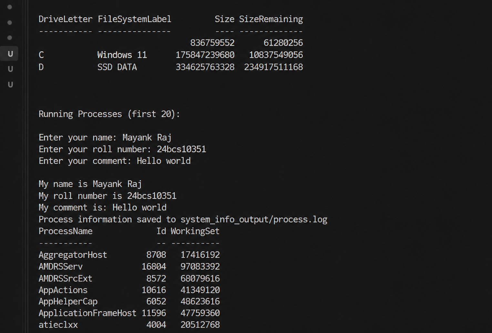

# System Information Shell Script

## Overview
This shell script displays basic system information, creates a directory and file, accepts user input, and stores running process information in a log file.

## Commands Used
- `mkdir -p`
- `touch`
- `echo`
- `date`
- `hostname`
- `whoami`
- `df`
- `ps`
- `read -p`
- Variables
- `>` and `>>` output redirection

## Features
- Prints current date, hostname, and username.
- Displays disk usage and running processes.
- Creates `system_info_output` directory.
- Creates `process.log` file.
- Stores process information in `process.log`.
- Takes user input (name, roll number, comment).
- Appends user details to the log file.



## How to Run

```bash
chmod +x system_info.sh
./system_info.sh
```

## Output Files

```text
system_info_output/
└── process.log
```

## Sample Output

```text
Current Date: Mon Aug 31 20:00:00 IST 2026
Hostname: ubuntu
Username: mayank

Disk Usage:
...

My name is Mayank Raj
My roll number is 24BCS10351
My comment is: Shell scripting completed

Process information saved to system_info_output/process.log
```

## Author
Mayank Raj
24BCS10351
